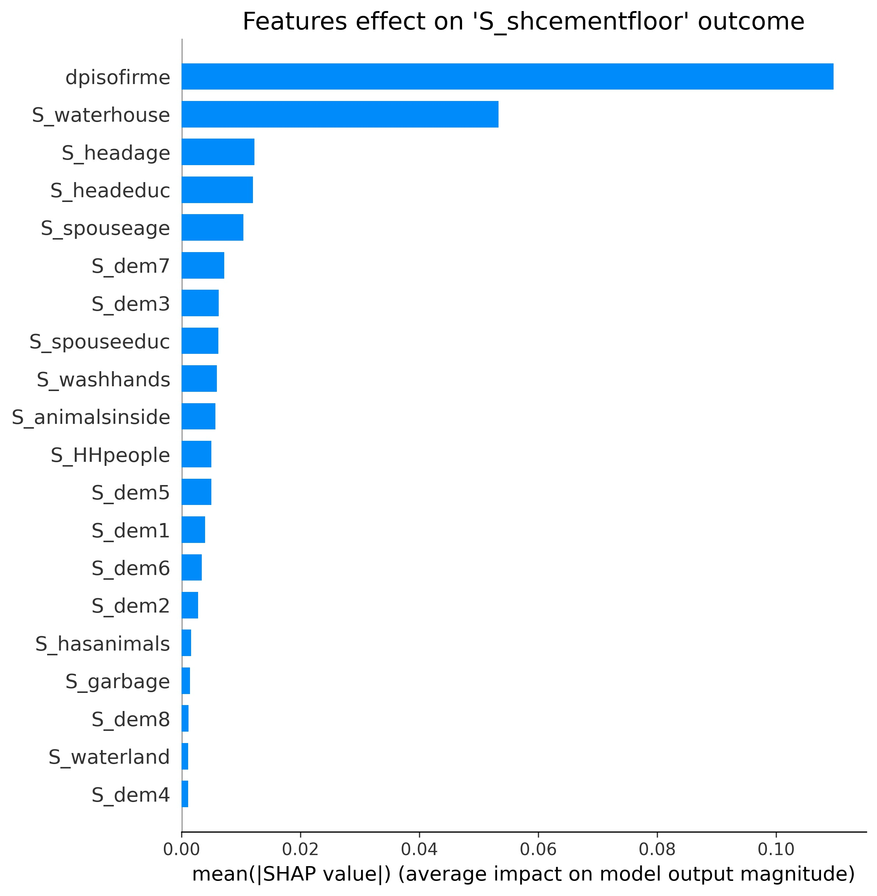

<h1>A NEW INTERPRETATION OF PISO FIRME PROGRAM'S EFFECTS</h1>

### Abstract

Some studies show that the richer you are, the more money you will likely make. Some other projects demonstrate that wealthy people are less inclined to have children. Do these assumptions still hold when it is the State's role to give money to the population ?  Can a program like Piso Firme (PF) bring additional hidden effects to the ones observed by Cattaneo and others?

This paper extension aims to analyze the effects of PF on the  average household's income and the number of children born in 2000-2005 for treatment and control groups. 

Furthermore, we assess the consistency of the results across more complex models.

Now, one would say: "Fellow dentists, complex models are complex! How could we assess the program's effects?". Answer:  <a href="https://papers.nips.cc/paper/2017/file/8a20a8621978632d76c43dfd28b67767-Paper.pdf"> SHAP (SHapley Additive exPlanations)</a>!  
SHAP interprets a prediction showing the impact of each feature of a model. Moreover, it allows us to visualize the impact of each variable and therefore, perhaps gain additional insight on the data.

---

### Researh questions

- Has Piso Firme had a significant impact on other socio-economical indicators, such as the average household's income growth between 2000 and 2005 and the natality rate in the same period?
- Do the authors' results, as long as the ones obtained answering to the previous question, still hold when considering more sophisticated models and evaluating the effect of each feature on the outcome considered with Shapley Additive Explanations (SHAP)? Will we find other, hidden, correlations that a Linear Regression can't catch?

---

### Proposed datasets

We propose to use the same datasets that the authors used for their research, namely:

- PisoFirme_AEJPol-20070024_household.dta (Household level data)
- PisoFirme_AEJPol-20070024_individual.dta (Individual level data)

---

### Methods

For the first reasearch question, we will use the paper's method: a simple OLS (Ordinary Least Square) Linear Regression implemented in Python's Statsmodel module. The steps we will follow will be:

- Preprocess the data (as the authors did)
- Create three models following the authors guidelines. In our case, we will not be able to use the variables `S_dem1` *(proportion of Males 0-5yrs in household in 2005)* and `S_dem5` *(proportion of Females 0-5yrs in household in 2005)* as control variables, because we are interested in PF impact on those indicator, so they will become the outcome of our three models. We will then do the same for the variables `S_incomep` *(total household income per capita in 2005)* and `S_assetspc` *(total value of household assets per capita in 2005)*.
- Create a table similar to the one in the model to assess the impact of PF on the new variables, trying to interpret the results.

For the second question, we want firstly to visualize the impact of each regression variable on the outcome using SHAP combined with the same Linear Regression model used by the authors, to confirm their assumptions. Then, we will explore the results of different ML models. We would like to start with a Decision Tree classifier, that we can visualize, to see how important is the dummy variable related to the program (When does the split occur? What's the information gain?).

After that, our idea is to implement a more powerful classifier, such as Random Forest, using SHAP to visualize the impact of each regression variable on the prediction. More precisely, the steps we will follow will be:

- We create three LinearRegression models using sklearn library. The models will have the same structure as the ones used by the authors in the paper.
- We use the SHAP LinearExplainer (<a href="https://shap.readthedocs.io/en/latest/generated/shap.LinearExplainer.html#shap.LinearExplainer">doc</a>) to explain the correlation between the features and the outcome in terms of SHAP value. 
- Plot and comment the results.
- For the Decision Tree, at first we need to split the continuous outcome variables in classes.
- We then use sklearn to build the model, and to visualize its structure. We will try to observe the model's parameters and structure to infer the impact of PF.
- A Decision Tree is not as powerfull as a Random Forest classifier, that could catch hidden correlations between the variables (spoiler: we already tried this method and we noticed something interesting...). We use, again, sklearn to build the model.
- We use the SHAP TreeExplainer (<a href="https://shap.readthedocs.io/en/latest/generated/shap.TreeExplainer.html#shap.TreeExplainer">doc</a>) to visualize the results.

 

    
     
    <b>Example: </b>
    <i>SHAP values plot for the outcome 'S_shcementfloor' - Random Forest</i>

 

__But what is SHAP, and why do we want to use it?__ 

SHAP values assess the impact of a given feature comparing the real predictions made to the predictions the model would make if that feature took a baseline value.
The question that SHAP tries to answer is: _"How much is my prediction driven by the fact that the feature A assumed that value, instead of the baseline one?"_

SHAP values have two interesting properties(<a href="https://towardsdatascience.com/explain-your-model-with-the-shap-values-bc36aac4de3d">Reference</a>):

- *Global interpretability*: The collective SHAP values can show how much each predictor contributes, either positively or negatively, to the target variable.
- *Local interpretability*: Each observation gets its own set of SHAP values. This greatly increases its transparency. We can explain why a case receives its prediction and the contributions of the predictors

We have to point out that SHAP values are originally used to assign each feature an importance value for **a particular prediction**. In our case we want to assess how relevant is a feature for the final prediction in general. For this reason
in the previous plot you read mean(|SHAP value|). Another thing to say is that in this case we only show the impact of each feature as a positive value, but we don't show if the correlation between the feature and the outcome is positive or negative. We will do this kind of analysis in our extension.

__To summarize:__ We have two goals. The first one is to check whether other variables have a bond with the Piso Firme program. The second one is to assess if the conclusions that the authors made (and that we made, in order to answer to our first question) are still valid under different models, visualizing the impact of each variable on the result using SHAP methodology.

___

### Proposed timeline

#### Week 1 (27/11 - 04/12):

During this first week we assess the impact of Piso Firme on the birth rate and the average household's income. 
We build new linear regression models, resembling the ones proposed by the authors, and we draw our conclusions, explaining our results.
We build a Linear Regression model with sklearn and we explore it with the help of SHAP values.

#### Week 2 (04/12 - 11/12):

In this week we build the new ML models that we want to explore. For the decision tree, we assess the impact of each variable plotting the model's structure and visualizing when the split occurs for the `dpisofirme` variable (the dummy variable used to distinguish between the treatment and the control group). We then create a Random Forest classifier, and we plot the results using SHAP, giving our interpretation and checking wether the assumptions of the paper still hold.

#### Week 3 (11/12 - 18/12):

We clean the Jupyter Notebook for the final submission. We write the report and the data story and we take some time to film and edit the final video.

___

### Organization within the team

- Francesco will focus on estimating the impact of the program on the new outcome variables in week 1. In week 2, he will take care of the decision tree and in week 3 he will be the person in charge to edit the video.
- Giorgio will build the linear regression model in week 1 and will start to build the skeleton code (functions) to create the different Random Forest models for the week 2. In week 3 he will take care of setting up the data story webpage.
- Amine in week 1 will focus on understanding if the obtained results are statistically significant. In week 2 he will try to explain in details what SHAP values are and, together with Francesco and Giorgio, he will interpret the week 2 results.
- The report and the data story will be written by the entire team together.

---

### Questions for TAs

We find the purpose of this extension interesting, but what about you? We would really love to have a feedback on our proposal.

